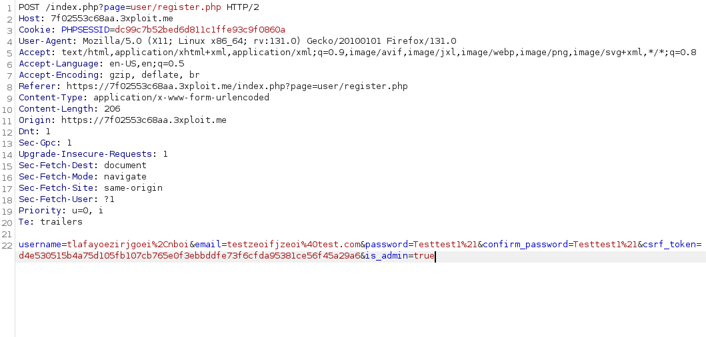
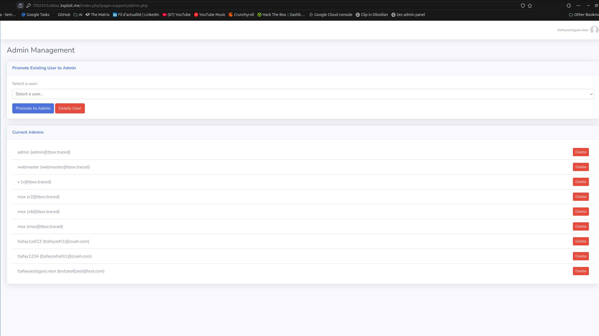

# Description  
When registering an account, it is possible to use mass assignment in order to escalate privileges, by supplying the `is_admin=true` parameter.

# Exploitation

- Navigate to https://<IP>/index.php?page=user/register.php, and register a user. Make sure you intercept the request.
- Add `&is_admin=true` to the body.
- Login to your newly created account. Notice the presence of the `Administration` page, indicating the privilege escalation was successful.

# PoC  

# Risk
An unauthenticated user can gain admin privileges, and therefore compromise the whole application.

# Remediation  
- Do not accept additional parameters to the ones expected.
- Make sure you handle the parameters given by the user properly
# Author
42Lyon
