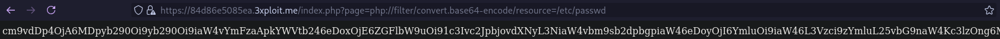
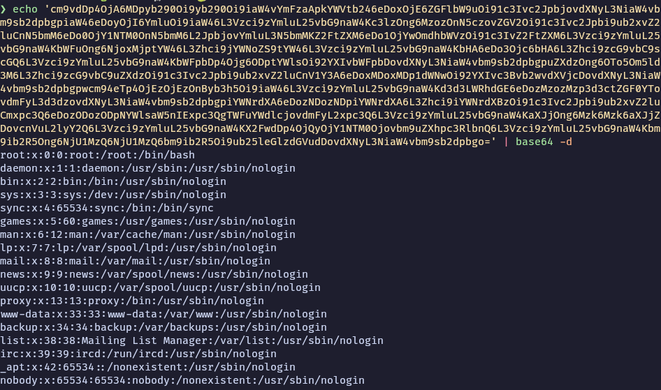

# Description
A Local File Inclusion (LFI) vulnerability was identified on the `page` GET parameter of `/index.php`.
The application uses this parameter to include PHP scripts, but insufficient validation allows an attacker to leverage PHP stream filters to read arbitrary files from the server, including sensitive configuration files and system files.

# Exploitation
The application normally uses the `page` parameter to include pages:
```
https://<IP>/index.php?page=user/profile.php
```

Since `page` corresponds to a path passed to PHP's `include`, we can use PHP stream filters to read file contents without executing them. The filter `php://filter/convert.base64-encode/resource=` encodes the target file in base64 before inclusion, bypassing PHP execution.

Payload to read `/etc/passwd`:
```
https://<IP>/index.php?page=php://filter/convert.base64-encode/resource=/etc/passwd
```

The server responds with a base64-encoded string of the file contents:



# PoC
Decoding the base64 response reveals the file contents. This can be done automatically with `curl` and `base64`:
```bash
$ curl 'https://<IP>/index.php?page=php://filter/convert.base64-encode/resource=/etc/passwd' -k -L | base64 -d
```



The output reveals system user accounts including `root`, `www-data`, and other service accounts, confirming arbitrary file read on the server.

# Risk
- View and exfiltrate sensitive information, including source code, user data, and application secrets
- Gain insights into server configuration and structure, facilitating further attacks (RCE, privilege escalation)
- Access files containing credentials, API keys, or other critical data for unauthorized access to other systems

# Remediation
1. Input Validation: properly validate and sanitize all user inputs; avoid directly including user-supplied data in file paths
2. Use of Whitelists: implement a whitelist of allowed files that can be included, rather than allowing arbitrary file inclusion
3. Disable Unnecessary PHP Functions: disable `include`, `require`, and `allow_url_include` if not needed
4. Web Application Firewall (WAF): deploy a WAF to detect and block LFI attempts

# Author
EPITA_SRS
