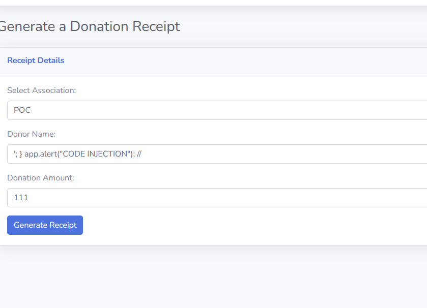
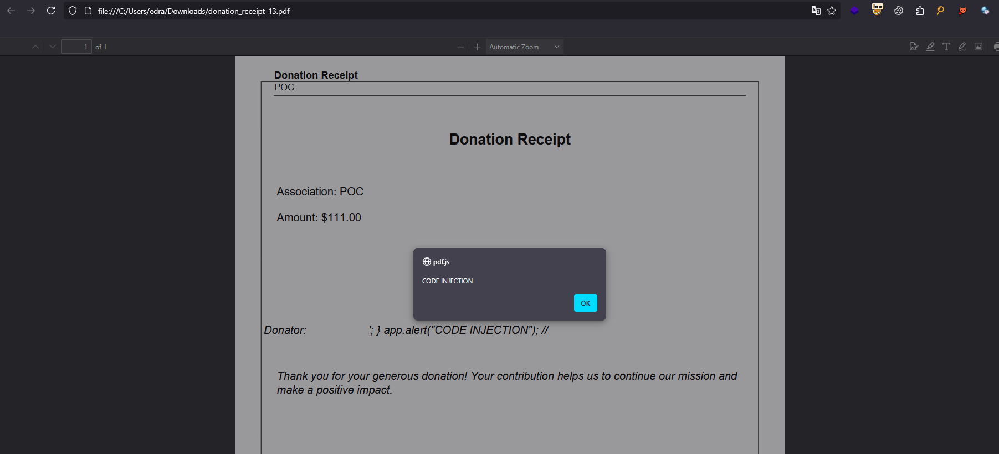

# Description  
The application allows users to generate donation receipts in PDF format, based on inputs such as the association name, donor name, and donation amount.  
However, it does not properly sanitize the data entered by the user before integrating it into the PDF content.  
Thus, it is possible to inject **JavaScript code** directly into the generated PDF file.  
When opening the PDF with a reader that supports JavaScript (such as **pdf.js** or certain browsers), this leads to **arbitrary JavaScript code execution**.

---

# Exploitation  
1. Access the "Generate a donation receipt" page.
2. In the "Donor name" field, enter the following payload:
   ```javascript
   '; } app.alert("CODE INJECTION"); //
   ```

3. Submit the form to generate the receipt.
4. Download and open the generated PDF with a browser or a PDF reader that supports JavaScript.
5. Observe the execution of JavaScript in the form of a displayed alert.


---

# PoC  
### Payload used:
```javascript
'; } app.alert("CODE INJECTION"); //
```

### Steps:
- Submit this payload in the "Donor name" field.
- Generate and download the PDF receipt.
- Upon opening the file, the JavaScript code executes automatically.

---

## Risk  
- **Malware dropper**: An attacker could generate a malicious PDF capable of downloading and executing malware upon opening.
- **Phishing**: The PDF could display a fake login page or a deceptive interface to steal credentials.
- **Execution in the browser context**: If the PDF is opened in a browser (e.g., via pdf.js), this would allow session hijacking, cookie theft, or redirection to malicious sites.
- **Reputational impact**: PDFs generated by your platform could be detected as malicious by antiviruses or browsers, which would severely tarnish your brand image.

---

## Remediation  
- **Input sanitization**: Properly sanitize all user inputs before integrating them into the PDF content.
- **Disable JavaScript**: If not necessary, completely disable the ability to execute JavaScript in generated PDFs.
- **Use a Content Security Policy (CSP)**: If you use a web viewer such as pdf.js, apply a strict CSP to limit the risks of script execution.
- **Server validation**: Implement server-side validation to reject any suspicious input containing potentially malicious code.

# Risk

This vulnerability could compromise the confidentiality, integrity, or availability of user data and application functionality.


# Remediation

Proper input validation, access controls, and security best practices should be applied to mitigate this vulnerability.

# Author
ESNA
