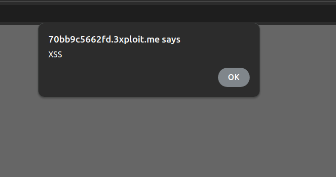

# Description

A Reflected Cross-Site Scripting (XSS) vulnerability exists in the login page. The `username` parameter is directly reflected in the HTML output without proper sanitization, allowing an attacker to inject malicious JavaScript code.

The vulnerable code in `user/login.php`:

```php
<form method="POST" class="user">
    <div class="form-group">
        <input type="text" class="form-control form-control-user" id="exampleInputUsername"
            name="username" placeholder="Enter Username..."
            value="<?php echo ($username); ?>" required>
    </div>
```

This is an unsanitized input from an HTTP parameter going into the `echo()` statement, where it is used to render an HTML page returned to the user.

# Exploitation

1. Navigate to `/index.php?page=user/login.php`.
2. In the `username` field, inject a payload such as `"><script>alert('XSS')</script>`.
3. Submit the form.
4. The malicious JavaScript executes when the page re-renders with the injected value.

The vulnerability was also confirmed via static code analysis.

# PoC

Intercept and modify the POST request:

```http
POST /index.php?page=user/login.php HTTP/2
Host: <IP>
Cookie: PHPSESSID=xxxxxxx
Content-Type: application/x-www-form-urlencoded

username="><script>alert('XSS')</script>&password=c
```

After submission, the injected JavaScript executes, triggering the `alert('XSS')` popup in the browser.



# Risk

This XSS vulnerability (CVSS 6.5) poses a significant risk:

1. **Session Hijacking**: Malicious JavaScript can steal session cookies, allowing an attacker to impersonate the user.
2. **Phishing**: The attacker could display fake login forms to steal credentials.
3. **Data Integrity**: Injected JavaScript could manipulate sensitive user data.

# Remediation

Use `htmlspecialchars()` to encode potentially dangerous characters:

```php
<input type="text" class="form-control form-control-user" id="exampleInputUsername"
       name="username" placeholder="Enter Username..."
       value="<?php echo htmlspecialchars($username, ENT_QUOTES, 'UTF-8'); ?>" required>
```

This converts characters like `<`, `>`, `"`, and `'` into their HTML-encoded equivalents, preventing script execution.

# Author
YNOV_SOPHIA-HoneyPotes
