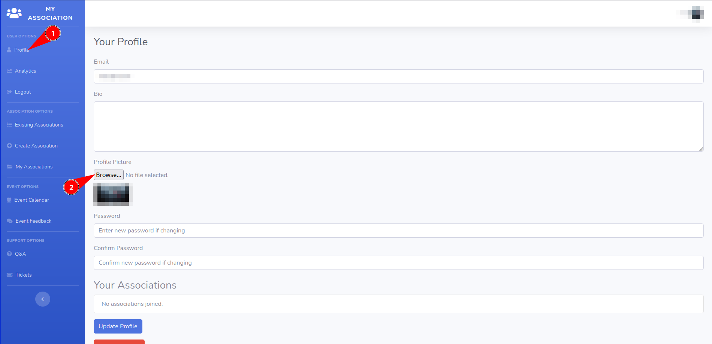
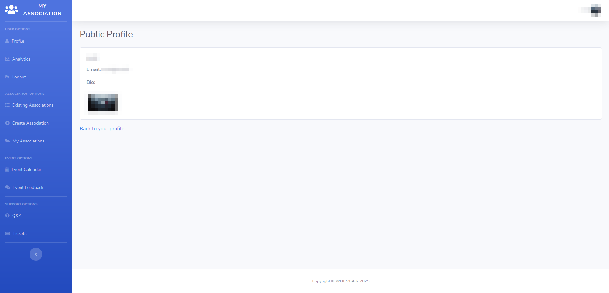
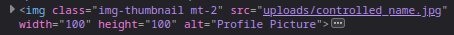
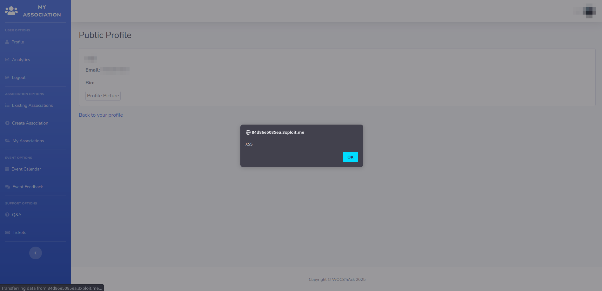

# Description
A Stored Cross-Site Scripting (XSS) vulnerability was identified in the Public Profile page's profile picture functionality.
The application uses the uploaded file name directly in an `` HTML tag without sanitization. Since the attacker controls the file name, they can escape the `src` attribute and inject arbitrary JavaScript that executes in the browser of any user viewing the public profile.

# Exploitation
1. Navigate to the Profile page (`/index.php?page=user/profile.php`)
2. In the Profile Picture upload field, select any image but rename it to:
```
x' onerror='alert(`XSS`)' name='.jpg
```



3. Save the profile. The malicious file name is stored on the server.
4. When any user visits the public profile page (`/index.php?page=user/public_profile.php`), the image tag is rendered as:
```html

```

The `src` attribute is broken by the injected single quote, causing the image to fail loading. The `onerror` event handler then fires and executes the JavaScript payload.





# PoC
After uploading the crafted file name, visiting the public profile triggers the XSS alert:



# Risk
- Stealing sensitive data such as session cookies
- Automatically downloading malware
- Displaying a fake login page to steal user credentials
- Performing unwanted actions with the victim's privileges

# Remediation
1. Sanitize the uploaded file name by escaping special characters or randomizing it entirely with only safe characters
2. Properly escape the file name in the DOM using `htmlspecialchars()` before rendering

# Author
EPITA_SRS
